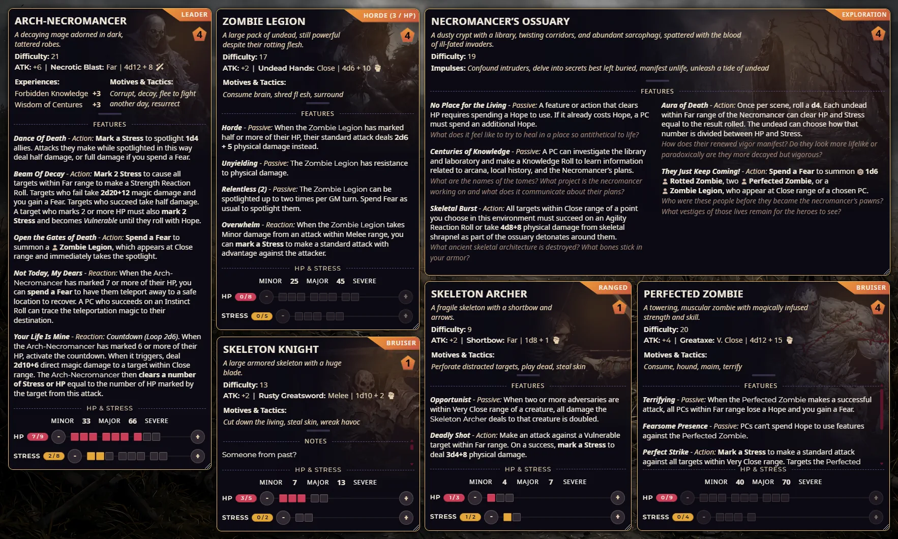

  

# Daggerheart Compact Sheets
Compact adaptive sheets for Daggerheart (Foundryborne) system.

## Installation

1. Copy https://github.com/Oxy949/daggerheart-compact-sheets/releases/latest/download/module.json
2. Paste it in your Foundry VTT, wait for install
3. Enable the module in your world
4. Enjoy!

## Highlights

- Compact character, adversary, and environment actor sheets
- Responsive and adaptive layout
- Dark and Light color sheme support
- Minimal player character layout with quick traits, Hope, HP, Stress, Armor, Loadout, Inventory, Biography, and Effects
- Quick pip controls for character and adversary resources
- Keeps the system item/effect partials, so core sheet actions still work
- Supports Carolingian UI theme (https://foundryvtt.com/packages/crlngn-ui)

## Usage Tips

- Hover the small strip under the sheet header to reveal tabs and sheet actions.
- Right-click the actor artwork to change the image or open sheet settings.

## Settings

Module settings are available in Foundry VTT under **Configure Settings > Module Settings > Daggerheart Compact Sheets**.

- **Use compact sheet as the default character sheet** - enabled by default. This is a world setting and requires a world reload after changing.
- **Use compact sheet as the default adversary sheet** - enabled by default. This is a world setting and requires a world reload after changing.
- **Use compact sheet as the default environment sheet** - enabled by default. This is a world setting and requires a world reload after changing.
- **Show interaction buttons on compact adversary and environment sheets** - enabled by default. This is a world setting that shows attack, chat, item action, and similar controls on compact adversary and environment sheets.
- **Show a separate HP and stress block on compact adversary sheets** - enabled by default. This is a world setting that shows HP, stress, and damage thresholds in a footer block. When disabled, the footer is hidden and those values move into the header summary.
  
## Credits
- [Oxy949](https://boosty.to/oxy949)
- https://freshcutgrass.app for some design inspiration
